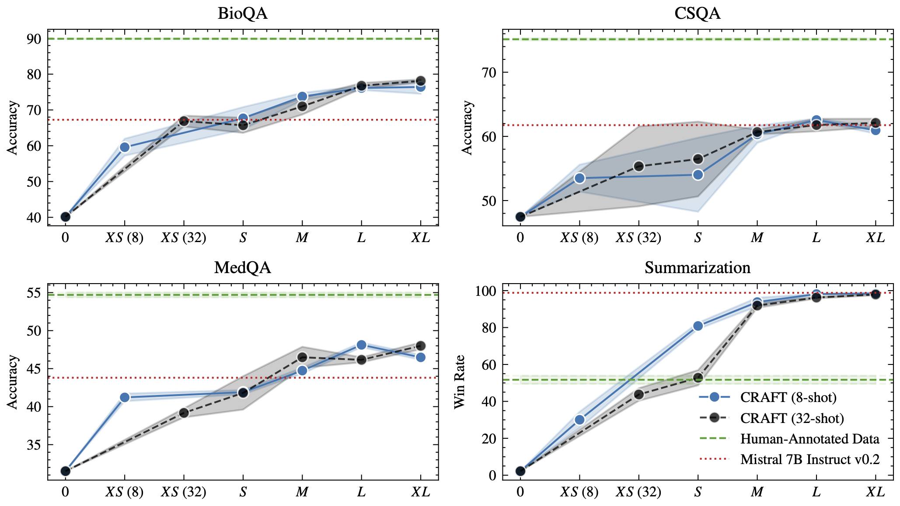
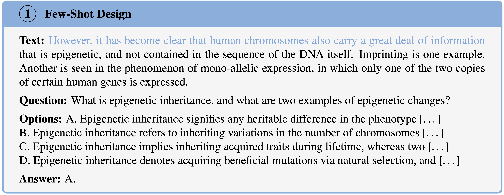

# CRAFT: Corpus Retrieval and Augmentation for Fine-Tuning


This repository contains the code, datasets, and additionally required files for the paper [CRAFT Your Dataset: Task-Specific Synthetic Data Generation Through Corpus Retrieval and Augmentation](https://arxiv.org/abs/2409.02098).

## Synthetic Datasets
We make all size variations of our crafted datasets available on Hugging Face:
* BioQA: [https://huggingface.co/datasets/ingoziegler/CRAFT-BioQA](https://huggingface.co/datasets/ingoziegler/CRAFT-BioQA)
* CommonSenseQA (CSQA): [https://huggingface.co/datasets/ingoziegler/CRAFT-CommonSenseQA](https://huggingface.co/datasets/ingoziegler/CRAFT-CommonSenseQA)
* MedQA: [https://huggingface.co/datasets/ingoziegler/CRAFT-MedQA](https://huggingface.co/datasets/ingoziegler/CRAFT-MedQA)
* RecipeGen: [https://huggingface.co/datasets/ingoziegler/CRAFT-RecipeGen](https://huggingface.co/datasets/ingoziegler/CRAFT-RecipeGen)
* Summarization: [https://huggingface.co/datasets/ingoziegler/CRAFT-Summarization](https://huggingface.co/datasets/ingoziegler/CRAFT-Summarization)

To use our human-written few-shots, simply filter the dataset for `is_few_shot == 1`, or load the `.jsonl` from `assets/{task}/few-shot/corpus-task-32.jsonl`.
Our 8 few-shot-based experiments simply use the first 8 lines of each file.

## Performance
Models trained on our synthetic datasets match the performance of general instruction-tuned LLMs and can even outperform training on human-curated data for tasks like summarization.



Our synthesized data is also more robust against distribution shifts because we do not generate data for a specific test set, but for an overall task.
This can be seen from the 5-gram overlap between our crafted datasets and the test sets, and comparing it to the in-domin train sets.
At maximum, our synthetic datasets have a 0.4% overlap, while in-domain train sets range up to 17.9% 5-gram overlap (see table below).

|                                               | BioQA | CSQA | MedQA | Summarization |
|-----------------------------------------------|-------|------|-------|---------------|
| CRAFT<sub>XS</sub>                            | 0.0%  | 0.0% | 0.0%  | 0.0%          |
| CRAFT<sub>S</sub>                             | 0.0%  | 0.1% | 0.1%  | 0.0%          |
| CRAFT<sub>M</sub>                             | 0.0%  | 0.2% | 0.1%  | 0.1%          |
| CRAFT<sub>L</sub>                             | 0.0%  | 0.4% | 0.3%  | 0.2%          |
| CRAFT<sub>XL</sub>                            | 0.0%  | 0.2% | 0.2%  | 0.2%          |
| Baseline <small>(In-domain Train Set)</small> | **17.9%** | **4.4%** | **1.1%**  | **0.3%**          |


Consequently, CRAFT's performance is stronger and more consistent across other test sets, e.g., MMLU.

| Dataset                            | Baseline | CRAFT<sub>XL</sub> |
|------------------------------------|----------|--------------------|
| In-domain                          | **89.9** | 78.1               |
| MMLU<sub>Medical Genetics</sub>    | 60.0     | **69.0**           |
| MMLU<sub>Anatomy</sub>             | 55.6     | **57.0**           |
| MMLU<sub>High School Biology</sub> | **69.3** | 67.4               |
| MMLU<sub>College Biology</sub>     | 66.7     | **74.3**           |
| MMLU-Avg                           | 62.9     | **66.9**           |


## Adapter Checkpoints:
Here, we provide the download links for the adapter checkpoints resulting from our fine-tuning on the CRAFT-XL versions. 
* BioQA: [https://huggingface.co/ingoziegler/CRAFT-BioQA-XL](https://huggingface.co/ingoziegler/CRAFT-BioQA-XL)
* CommonSenseQA (CSQA): [https://huggingface.co/ingoziegler/CRAFT-CommonSenseQA-XL](https://huggingface.co/ingoziegler/CRAFT-CommonSenseQA-XL)
* MedQA: [https://huggingface.co/ingoziegler/CRAFT-MedQA-XL](https://huggingface.co/ingoziegler/CRAFT-MedQA-XL)
* RecipeGen: [https://huggingface.co/ingoziegler/CRAFT-RecipeGen-XL](https://huggingface.co/ingoziegler/CRAFT-RecipeGen-XL)
* Summarization: [https://huggingface.co/ingoziegler/CRAFT-Summarization-XL](https://huggingface.co/ingoziegler/CRAFT-Summarization-XL)

## Running CRAFT
Our experiments are based around Python 3.10.9, Pytorch 2.2.1, and vllm 0.4.1. For details, check `requirements.txt`.

The pipeline consists of 5 steps that have to be performed sequentially.

### If you want to CRAFT your own dataset:
In general, you have to follow the same steps as if you were reproducing our experiments [as described below](#reproducing-our-experiments).

#### Embedding Database
You can either use our embedding database and corpora mentioned under [Step 0 below](#step-0-download-required-files-and-set-up-the-directory-structure), or you can extend our embedding database with your public/private corpora, or you can create your own specialized embedding database with corresponding corpora using your private or other public datasets.

Currently, our code only features the experiments from our paper ready, so you will need to adapt the scripts and run configs a bit.
You can still use large parts from our run configs from `code/run_configs/` as the baseline, but you will need to change the paths pointing to our databases and corpora files.
Additionally, when running finetuning and evaluation, you will need to write code for your task sample design, as well as provide your evaluation dataset and format it accordingly.
Nonetheless, the general structure stays the same.

To create an embedding database, we provide the files we used to embed our corpora and create the database.
* Run `python3 code/create_embeddings.py $(code/run_configs/embed/stackexchange.cfg)`
* This will create an `.h5` database with 16-bit precision NumPy arrays using [multi-qa-MiniLM-L6-cos-v1](https://sbert.net/docs/sentence_transformer/pretrained_models.html) from the SentenceTransformer suite as the embedding model.
* The embedding database is set up in a way where each document's embedding corresponds to one 'row' in the H5 database
* Therefore, you can retrieve documents by enumerating the documents in your corpus, and retrieve the corresponding array from the embedding database, or vice-versa.

#### New tasks
* You need to create 8 to 32 few-shots with the content and design of your task. See our [provided few-shots](#synthetic-datasets) and the image below as examples for the different tasks.
    * Place them under `assets/{task}/few-shot/corpus-task-32.jsonl`
* The rest of the pipeline stays the same. Continue with [Step 1 from below](#step-1-corpus-retrieval)




If you have any questions, feel free to open a GitHub issue.

### Reproducing our experiments
Have a look at `code/utils/args.py` for all available runtime arguments.
We provide our pre-filled argparse run configs for all experiments under `code/run_configs/`.
The few-shots for all tasks are also available in `assets/{task}/few-shot/corpus-task-32.jsonl`, so you can start running/reproducing our experiments.

#### Step 0: Download required files and set up the directory structure
* Embedding database: Download our embedding database from the link below and place it under `datasets/embeddings.h5`
    * http://data.cis.lmu.de/data/craft/embeddings.h5
    * Please note that we host the files on an `http` address. If your browser autocompletes to `https`, you may need to manually adjust the link. Sometimes, you may also have to paste the address into the search bar directly.
    * We provide the sha256 checksum for the file in this repository in `checksum`
* C4: Download the 305GB `en` version of C4 from [Hugging Face](https://huggingface.co/datasets/allenai/c4). We used the Git download version. It is not mentioned there that you have to run `git lfs checkout` after everything is downloaded so that the lazy files are actually linked to the downloaded files. 
* Wikipedia: Download our cleaned Wikipedia corpus samples from the link below and place them under `datasets/wikipedia/cleaned/`
    * http://data.cis.lmu.de/data/craft/wikipedia_cleaned.tar.gz
    * Please note that we host the files on an `http` address. If your browser autocompletes to `https`, you may need to manually adjust the link. Sometimes, you may also have to paste the address into the search bar directly.
    * We provide the sha256 checksum for the file in this repository in `checksum`
* WikiHow: Download our cleaned WikiHow corpus samples from the link below and place them under `datasets/wikihow/cleaned/`
    * http://data.cis.lmu.de/data/craft/wikihow_cleaned.tar.gz
    * Please note that we host the files on an `http` address. If your browser autocompletes to `https`, you may need to manually adjust the link. Sometimes, you may also have to paste the address into the search bar directly.
    * We provide the sha256 checksum for the file in this repository in `checksum`
* StackExchange: Download our cleaned StackExchange corpus samples from the link below and place them under `datasets/stackexchange/cleaned/`
    * http://data.cis.lmu.de/data/craft/stackexchange_cleaned.tar.gz
    * Please note that we host the files on an `http` address. If your browser autocompletes to `https`, you may need to manually adjust the link. Sometimes, you may also have to paste the address into the search bar directly.
    * We provide the sha256 checksum for the file in this repository in `checksum`
* Make sure that each task folder under `assets/` has the following subfolder available: `assets/{task}/corpus_samples/`, `assets/{task}/outputs/`, `assets/{task}/results/`, `assets/{task}/task_samples/`
* Create a `model_ckpts` directory. All LoRA adapters will be saved here
* Create a `models/hf_models` directory and place the model you want to use for task sample creation in there (e.g. Mistral 7B Instruct v0.2), as well as the model you want to fine-tune (e.g. Mistral 7B v0.2), and the model you want to evaluate again (e.g. Mistral 7B Instruct v0.2, too). If you evaluate a generative task, such as summarization, you should also load LLaMA 3 70B Instruct into this directory.
* Make sure you have a valid Hugging Face token to load the required models. Name it `hf-llama.privkey` and place it in the root directory
* If you just want to reproduce our evaluation accuracies, download the LoRA adapters linked [here](#adapter-checkpoints) and jump directly to [Step 4](#step-4-evaluate-the-model).
    * Place the adapter in `model_ckpts/{taks}/mistral-7b-v0.2-32-mixed-25k-seed_1234/` (check the specific seed in the Hugging Face repository description)

#### Step 1: Corpus Retrieval
* Run `python3 code/retrieve_docs.py $(cat code/run_configs/{task}/retrieve/32-mixed-50k.cfg)` or any other size of documents you want to retrieve
* This will retrieve all corpus samples and place them into `assets/{task}/corpus_samples/32-mixed-50.jsonl`

#### Step 2: Create task samples
* Run `python3 code/create_task_samples.py $(cat code/run_configs/{task}/create_tasks/mistral-7b-instruct-v0.2-32-mixed-50k.cfg)`
* This will create 25,000 final task samples for the chosen task and place them into `assets/{task}/task_samples/32-mixed-25000/` as `.arrow` files
    * It will also save the raw and cleaned (but not as `.arrow`) versions of task samples under `assets/{task}/task_samples/32-mixed-50k-raw.jsonl`, `assets/{task}/task_samples/32-mixed-50k-clean.jsonl`, `assets/{task}/task_samples/32-mixed-50k-error_msgs.csv`.
    * The error message file documents formatting errors found in task sample output, not general `stderr` outputs.

#### Step 3: Fine-tune the model
* Run `python3 code/run_finetune.py $(cat code/run_configs/{task}/finetune/lora/mistral-7b-v0.2-32-mixed-25k-seed_1234.cfg)` (or seed 2024, 9999)
* This will LoRA-fine-tune a base Mistral 7B v0.2 model and place the adapters in `model_ckpts/{taks}/mistral-7b-v0.2-32-mixed-25k-seed_1234/`
    * Our training script only keeps the adapters of the last performed epoch - in this case epoch 3 will be kept

#### Step 4: Evaluate the model
* Run `python3 code/run_eval.py $(cat code/run_configs/{task}/evaluate/lora/mistral-7b-v0.2-32-mixed-25k-seed_1234.cfg)` (or seed 2024, 9999)
* This will load the base model as well as the adapters, merge them in a temporary directory (the temporary directory will be cleaned up and deleted automatically), and run eval on the task-specific dataset (e.g. the BioQA subset of Science QA, if `'bioqa'` was chosen as the task).
* The script will save the instructions and model-generated outputs for each test sample in `assets/{task}/outputs/lora/mistral-7b-v0.2-lora-32-mixed-25k-seed_1234.jsonl`
* If you chose a classification task:
    * The script will save the evaluation accuracy under `assets/{task}/results/lora/mistral-7b-v0.2-lora-32-mixed-25k-seed_1234.json`
* If you chose a generative task:
    * You will need to run the additional script `python3 code/run_eval_winrate.py $(cat code/run_configs/{task}/evaluate/lora/mistral-7b-v0.2-32-mixed-25k-seed_1234.cfg)` to calculate the win rate of the model outputs (saved under `assets/{task}/outputs/`) and the evaluation dataset answers with LLaMA 3 70B Instruct as the judge
    * This will then save the win rate under `assets/{task}/results/lora/mistral-7b-v0.2-lora-32-mixed-25k-seed_1234.json`


Your are done! Should you have any questions, feel free to open a GitHub issue.

## Citation
If you use our code, datasets, or model checkpoints in your research, please cite the following paper:

```
@misc{ziegler2024craft,
      title={CRAFT Your Dataset: Task-Specific Synthetic Dataset Generation Through Corpus Retrieval and Augmentation}, 
      author={Ingo Ziegler and Abdullatif Köksal and Desmond Elliott and Hinrich Schütze},
      year={2024},
      eprint={2409.02098},
      archivePrefix={arXiv},
      primaryClass={cs.CL},
      url={https://arxiv.org/abs/2409.02098}, 
}
```